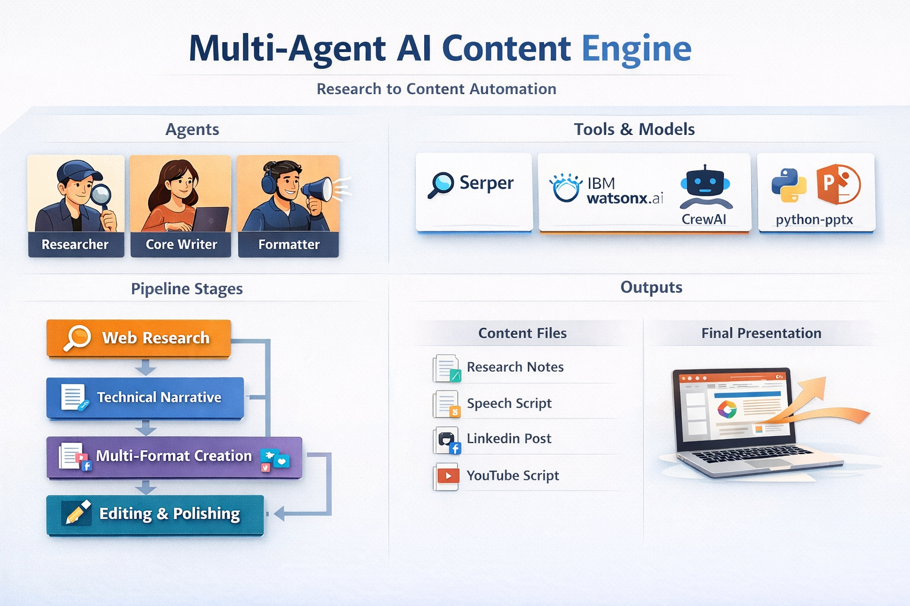

# Multi-Agent AI Content Engine — Production Edition


A **production-ready multi-agent pipeline** that transforms a single input topic into a complete structured content pack using **CrewAI**, **IBM watsonx.ai**, **Serper**, and **python-pptx**.

Given any user-provided topic, this system automatically generates:

- Web research + insights
- Technical long-form narrative
- Keynote speech script
- LinkedIn post
- YouTube script
- Slide outline
- Final polished content pack
- PowerPoint deck (`.pptx`)
- Structured text artifacts

This repository represents the **Production Edition** of the system. A **Beginner Edition** will be released separately for educational use.

---

## ✨ Key Capabilities

✔ Multi-agent orchestration  
✔ Multi-model LLM execution (reasoning + tool calling + formatting)  
✔ Real web search integration  
✔ Deterministic content generation  
✔ Artifact-based workflow  
✔ Automatic slide deck generation  
✔ Production-safe file handling  
✔ Clear extensible architecture  

---

## 🧩 System Architecture Overview

<br>

## 📊 Infographic — Multi-Agent Architecture Overview



<br>


### **Agents (Specialized Roles)**

| Agent | Purpose |
|---|---|
| **Researcher** | Performs structured web research via Serper |
| **Core Writer** | Produces 800–1200 word technical narrative |
| **Formatter** | Repurposes content into speech, scripts & posts |
| **Editor** | Polishes tone, clarity & consistency across formats |

<br>

### **Tasks (Pipeline Stages)**

| Stage | Output |
|---|---|
| **Task 1 — Research** | `01_research_notes.txt` |
| **Task 2 — Narrative** | `02_core_narrative.txt` |
| **Task 3 — Multi-format** | `03_multiformat_content_pack_raw.txt` |
| **Task 4 — Edit** | `04_multiformat_content_pack_final.txt` |

<br>

### **Tools + Libraries**

| Component | Purpose |
|---|---|
| **CrewAI** | Agent & task orchestration |
| **SerperDevTool** | Web search tooling |
| **WatsonxLLM** | LLM model interface |
| **LLAMA 70B** | Reasoning + long-form writing |
| **Mistral Small** | Tool & deterministic execution |
| **python-pptx** | Slide deck generation |
| **Python 3.9+** | Execution environment |

---

## 🧠 Multi-Model LLM Strategy

The system uses **multiple models for different competencies**:

| Model | Role |
|---|---|
| `Llama 3.3 70B` | Reasoning + narrative + editing |
| `Mistral Small 24B` | Function calling + deterministic web tool execution |
| `Llama 3.3 70B (extended tokens)` | Formatting + polishing |

This is aligned with practical production agent orchestration patterns.

---

## 🏁 End-to-End Workflow

```text
User Topic Input
        ↓
Research Agent (web search)
        ↓
Core Writer (long-form narrative)
        ↓
Formatter (speech, post, script, slides)
        ↓
Editor (polish + unify)
        ↓
Artifact Split & File Write
        ↓
PPTX Slide Deck Generation
        ↓
Final Content Pack
```

## 📦 Output Artifacts

All generated assets are saved under:

```python
content_output/
```

Artifacts include:
```text
01_research_notes.txt
02_core_narrative.txt
03_multiformat_content_pack_raw.txt
04_multiformat_content_pack_final.txt
keynote_speech.txt
linkedin_post.txt
youtube_script.txt
slide_outline.txt
slides.pptx
```

These can be used for:

✔ Conference decks
✔ Founder storytelling
✔ LinkedIn social content
✔ YouTube/Video scripting
✔ Workshops & training material
✔ Corporate communication
✔ Product marketing
✔ Research explainability

---

## 🛠 Installation & Environment Setup

This project is tested on **Python 3.11** and uses a `virtualenv` for isolation.

> ⚠️ **Important:** Other Python versions may work but are not officially supported.

### **1. Clone the Repository**

```bash
git clone https://github.com/<your-username>/<repo-name>.git
cd <repo-name>
```

## 2. Create a Virtual Environment (Recommended)

Using venv:
```bash
python3.11 -m venv venv
```

Activate it:
In macOS / Linux:

```bash
source venv/bin/activate
```

In Windows (PowerShell):

```bash
venv\Scripts\Activate.ps1
```

## 3. Install Dependencies

All Python dependencies are pinned in requirements.txt.

Install with:

```bash
pip install -r requirements.txt
```

## 4. Export Required Environment Variables

The system requires API keys for:

IBM watsonx.ai

Serper (web search)

Export them in your terminal:

```bash
export WATSONX_APIKEY="your-watsonx-api-key"
export SERPER_API_KEY="your-serper-api-key"
```
🔐 Security Note: Do not commit API keys. Use .env or a secrets manager in production.


## 5. Configure IBM watsonx.ai Project

Ensure the following are set correctly:
- URL (region endpoint)
- PROJECT_ID (IBM Cloud Project ID)

```bash
URL = "https://eu-de.ml.cloud.ibm.com"
PROJECT_ID = "<your_project_id>"
```


## 6. Run the Pipeline

Execute the main script:

```python
python multi_agent_content_orchestra.py
```

When prompted, enter the topic:

```python
Enter the topic you want to generate content for:
```

## 7. Verify Outputs

Generated files will appear under:

```bash
content_output/
```

Contents include:
- research notes
- narrative
- multi-format content
- polished content pack
- individual channel files
- .pptx slide deck

---

## 📜 License

This project is licensed under the **MIT License** — see the [`LICENSE`](LICENSE) file for details.

